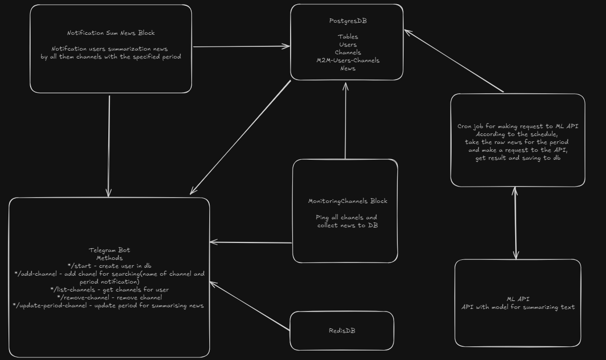

# Telegram bot for new summarising

## Схема

## Отчет
Этот отчет покрывает только часть связанную с написанием бота, ml модель лежит в отдельном репозитории

### Сделанные этапы на 02.02.2024
1. Проектирование базовой структуры взаимодействия модулей
2. Определение методов поддерживаемых ботом
3. Выбор фреймворка для написания бота
4. Выбор баз данных для работы
5. Создание бота в telegram
6. Подготовка конфигурационных файлов и файлов инфраструктуры для проекта
7. Схематичное описание методов для проверки работы бота
8. Разработка моделей баз данных, которые будут хранить информацию о подписках пользователей и новостях
9. Настройка CI/CD
10. Написание методов взаимодействия с базами данных
11. Разработать часть методов в боте /login /add_channel /list_channels /remove_channel /logout

### Дальнейшие этапы
1. Разработать метод /update_period_channel
2. Разработать блок прохода по каналам и сохранение новостей в базу данных
3. Написать GET запросы для получения результатов суммаризации от модели
4. Разработать блок рассылки выжимки новостей по пользователям
5. Развертывание систему на VPS сервере